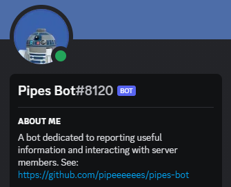
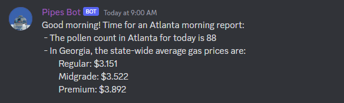
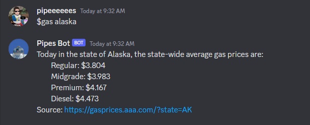
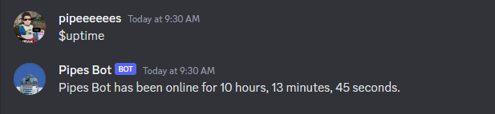

# Pipes Bot 🤖

Pipes Bot is a Discord bot created as a hobby project, but has now turned into conglomeration of python modules that I can run via commands over Discord. It is deployed on a local home server in my apartment.

Key features include:
- a spotify keyword search for finding relevant music
- gpt-3 implementation
- gas price reporting
- pollen count reporting (Georgia)
- setting reminders
- a weekday morning news report to my subscribed friends
- wishing people happy birthday
- various fun responses to group chat messages

 
**Pipes Bot's Profile**

## Usage
The bot runs permanently on my home server. Chat with it by messaging **'Pipes Bot#8120'** on Discord (ID 924431531777359943). Try the following commands:
- **'$pollen'**: to see Atlanta's pollen count
- **'$gas [state]'**: to see average state gas prices. Replace [state] with a state name or 2-letter initials
- **'$spotify [keyword]'**: to perform a spotify search for music relating to a keyword of your choice. It might take 5 or more minutes due to rate limiting.
- **'$pipesbot, [query]'**: to ask davinci gpt-3 a query.
- **'$uptime'**: to get bot uptime 
- **'dennys'**: surprise classic
- **'$birthday [mm-dd-yyyy]'**: Pipes Bot will remember your birthday and wish you a happy birthday on your birthday
- **'$remindme, [mm-dd-yyyy], [hh-mm], [reminder]'**: Pipes Bot will remind you on a specified date and time of your reminder
- **'$reminders'**: will return all reminders numbered 1-N
- **'$reminders delete [num]'**: will delete a reminder when passed in the reminder number (1-N)

## Navigation
All of my most recent developments happen on the dev branch. I will merge to main on large releases. Pipes Bot usually runs off of the latest dev commit. Look at **main.py** to see the orchestration of the bot, in **root/pipesbot/** you will find all of my modules. Important modules include **message_handler.py** which processes incoming messages, **schedule_messages.py** which handles monitoring the time and accesses the **SQLite** database, and **db_handler.py** which is a custom python wrap for the database. 

## Screenshots

**Scheduled Reports**
 

**Davinci GPT-3 (ChatGPT) Implmentation (For the record, I am not geometrically challenged 😉)**
 

**Pipes Bot occasionally reacts to random text in group chats. ('SHEEEEESH' is said more than you'd think)**
 

**Gas Price Command**
 

**Uptime Command**
 

